# Arquitetura de Testes

## Visão geral

```mermaid
graph TD
    subgraph "Spec Files (.cy.ts)"
        S1[amazon/smoke/*.cy.ts]
        S2[amazon/exploration/*.cy.ts]
        S3[automation-exercise/**/*.cy.ts]
    end

    subgraph "Page Objects (POM)"
        P1[pages/amazon/BasePage.ts]
        P2[pages/amazon/HeaderPage.ts]
        P3[pages/amazon/SearchResultsPage.ts]
        P4[pages/amazon/ProductPage.ts]
        P5[pages/amazon/CartPage.ts]
        P6[pages/amazon/LoginPage.ts]
        P7[pages/automation-exercise/LoginPage.ts]
        P8[pages/automation-exercise/ProductsPage.ts]
        P9[pages/automation-exercise/CartPage.ts]
        P10[pages/automation-exercise/CheckoutPage.ts]
    end

    subgraph "Support Layer"
        C3[commands/assertions.ts]
        U1[utils/viewports.ts]
        D1[index.d.ts — typings]
    end

    subgraph "Fixtures (Test Data)"
        F1[amazon/search-terms.json]
        F3[amazon/departments.json]
        F4[amazon/forms.json]
        F5[automation-exercise/users.json]
        F6[automation-exercise/products.json]
        F7[automation-exercise/checkout-data.json]
    end

    subgraph "Config"
        CF[cypress.config.ts]
    end

    S1 & S2 --> P1 & P2 & P3 & P4 & P5 & P6
    S3 --> P7 & P8 & P9 & P10
    S1 & S2 & S3 --> C3
    S1 & S2 --> F1 & F3 & F4
    S3 --> F5 & F6 & F7
    S2 --> U1
    CF --> S1 & S2 & S3
```



---

## Princípios de design

### 1. Page Object Model (POM)

Cada página tem uma classe TypeScript com:
- **`elements`** — seletores centralizados (atualizar em 1 lugar)
- **Métodos de ação** — interações com a UI (`fillEmail`, `clickLogin`)
- **Métodos de asserção** — verificações (`assertLoggedIn`, `assertErrorVisible`)
- **`visit()`** herdado de `BasePage`

```typescript
// Princípio: specs falam "o que fazer", não "como fazer"
// ✅ Correto
login.fillEmail(user.email);
login.clickContinue();
login.assertErrorMessageVisible();

// ❌ Errado (implementação no spec)
cy.get('#ap_email').type(user.email);
cy.get('#continue').click();
cy.get('.a-alert-content').should('be.visible');
```

### 2. Seletores centralizados

```typescript
// Todos os seletores em uma constante exportada
export const loginSelectors = {
  emailInput: '#ap_email_login, #ap_email',
  continueButton: '#continue, input[type="submit"]',
  // ...
} as const;

// Specs importam do POM, nunca hardcode de seletor
cy.get(login.elements.emailInput)  // ✅
cy.get('#ap_email')                 // ❌
```

### 3. Zero `cy.wait(ms)` — Espera baseada em eventos

```typescript
// ✅ Espera por estado/elemento
cy.get(selector).should('be.visible');
cy.get(selector).should('contain.text', 'texto');

// ✅ Espera por resposta de rede
cy.intercept('GET', '/api/products*').as('products');
cy.visit('/');
cy.wait('@products');

// ❌ Jamais
cy.wait(2000);
```

### 4. Custom Commands tipados

```typescript
// cypress/support/index.d.ts — Augmenta o namespace Cypress
declare global {
  namespace Cypress {
    interface Chainable {
      assertUrlContains(text: string): Chainable<void>;
      assertTitleContains(text: string): Chainable<void>;
    }
  }
}

// Uso com autocomplete e type-safety:
cy.assertUrlContains('k=notebook'); // ✅ TypeScript verifica o tipo
cy.assertUrlContains(42);           // ❌ Erro de compilação
```

### 5. Fixtures para testes data-driven

```typescript
// Dados de teste separados do código
cy.fixture('amazon/search-terms').then((data) => {
  data.validTerms.forEach(({ term }: { term: string }) => {
    cy.visit('/');
    search.searchProduct(term);
    search.assertResultsVisible();
  });
});
```

---

## Estrutura de camadas

```
┌─────────────────────────────────────┐
│            Spec Files               │  "O que testar"
│     (cypress/e2e/**/*.cy.ts)        │
├─────────────────────────────────────┤
│          Page Objects               │  "Como interagir com a página"
│       (cypress/pages/**/)           │
├─────────────────────────────────────┤
│         Custom Commands             │  "Ações reutilizáveis globais"
│     (cypress/support/commands/)     │
├─────────────────────────────────────┤
│           Fixtures                  │  "Dados de teste"
│       (cypress/fixtures/**/)        │
├─────────────────────────────────────┤
│         Configuration               │  "Ambiente e ferramentas"
│      (cypress.config.ts)            │
└─────────────────────────────────────┘
```

---

## Decisões de design

### Por que POM em vez de App Actions?

O projeto usa **POM puro** em vez do padrão [App Actions](https://www.cypress.io/blog/stop-using-page-objects-and-start-using-app-actions) do Cypress porque:
- Testamos **sites de terceiros** — sem acesso ao código da aplicação para expor `window.app`
- POM é mais familiar para QA Engineers de outras ferramentas (Selenium, Playwright)
- Para um portfólio, demonstrar POM mostra conhecimento do padrão mais difundido no mercado

### Por que dois SUTs?

| Critério | Amazon | AutomationExercise |
|---|---|---|
| Controle sobre DOM | Nenhum | Total (`data-qa` attrs) |
| Estabilidade de seletores | Baixa (A/B tests) | Alta |
| API disponível | Não | Sim (REST público) |
| Autenticação automatizável | Não (CAPTCHA) | Sim |
| Valor de portfólio | Demonstra adaptação a restrições reais | Demonstra boas práticas |

Um QA maduro sabe **quando** automatizar contra produção de terceiros e quando não. Ter os dois SUTs documenta esse raciocínio explicitamente.
